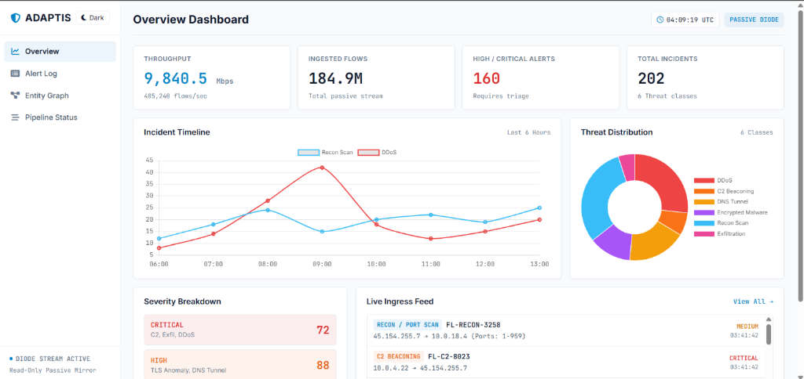
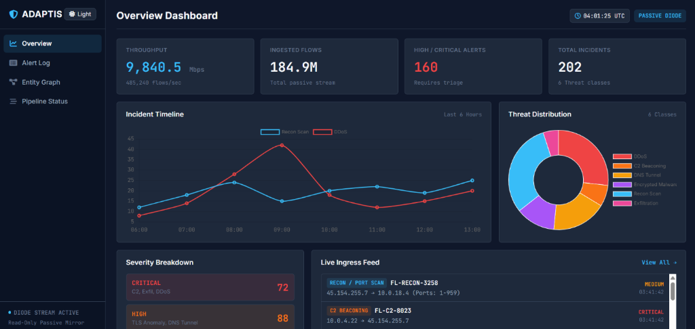
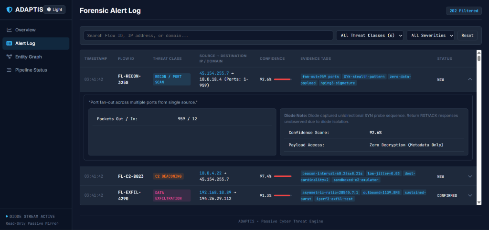
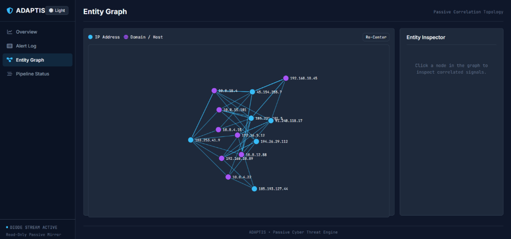
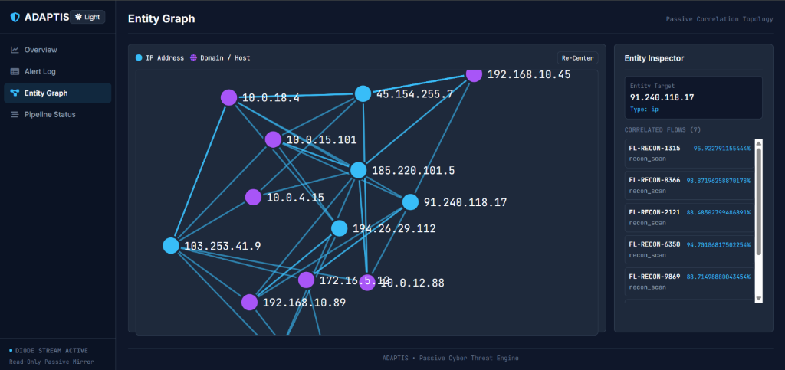

# ADAPTIS — AI-Based Cyber Threat Detection Engine in Unidirectional IP Traffic

**Smart India Hackathon (SIH 2026) Submission**  
**Problem Statement 26145** | **Organization**: NTRO | **Theme**: Blockchain & Cybersecurity


---

## 📷 UI Screenshots & Screenshots

### Overview Dashboard (Dark & Light Theme Modes)



### Forensic Alert Log


### Entity Graph Correlation Topology



---

## Overview

**ADAPTIS** is a passive cyber threat detection console designed to analyze one-way (data-diode / mirrored) network traffic. The system passively observes ingress telemetry without return-path capabilities (read-only, zero return path).

### Detected Threat Classes (Metadata Only)
1. **Volumetric / Protocol DDoS** (`hping3` SYN floods, UDP amplification, `Slowloris` connection floods)
2. **Botnet C2 Beaconing** (Sandboxed C2 emulator periodic 60s connections with low jitter)
3. **DGA / DNS Tunnelling** (`dnscat2`, `iodine`, `DGArchive` query entropy & n-gram anomalies)
4. **Encrypted Session Malware** (TLS 1.3 ClientHello JA3/JA3S/JA4 fingerprints, timing/size sequence)
5. **Reconnaissance / Port Scanning** (`hping3` SYN port fanouts)
6. **Data Exfiltration** (`iperf3` asymmetric outbound/inbound byte ratios)

---

## Tech Stack

- **Backend**: Python 3.11, Flask, Flask-SQLAlchemy, Flask-SocketIO
- **Frontend**: HTML5, CSS3 Minimal Design System (Dark & Light Theme Mode Toggle), Chart.js 4.4, D3.js 7.8
- **Containerization**: Docker, Docker Compose

---

## Quick Start with Docker

To build and launch the ADAPTIS container using Docker Compose:

```bash
docker compose up -d --build
```

Access the dashboard at **`http://localhost:5000`**.

### Standalone Docker Run

```bash
docker build -t adaptis:latest .
docker run -p 5000:5000 adaptis:latest
```

---

## Local Development (Without Docker)

1. Install dependencies:
   ```bash
   pip install -r requirements.txt
   ```
2. Launch application:
   ```bash
   python app.py
   ```
3. Open browser at `http://127.0.0.1:5000`.
